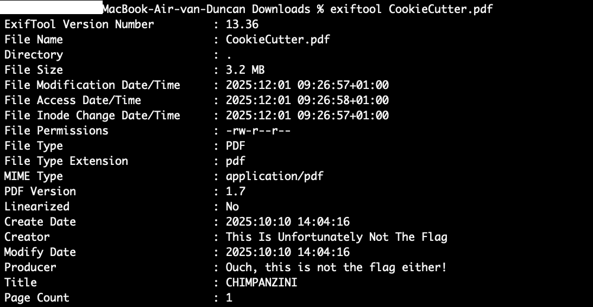
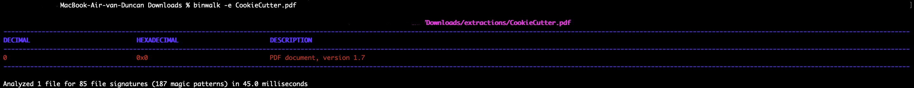
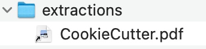

# Cookie Cutter
misc/Cookie Cutter

Author: vrooom

Solver: Duncan (aka me)

Difficulty easy
## Solution
When I looked at the description of this challenge it said that you dont have to cut too much of your "cookies".

I downloaded the pdf file and saw a image of a gen Alpha thing (I'm from 2009 so still gen z I can roast gen Alpha stuff legally). 

In my terminal I immidiadly tried to exiftool the file but got raigebaited by the author.

After seeing this I tried another command without the output I want to have called binwalk. I tried to extract the data from the pdf file with this command.

When I saw it didn't work I didnt really know what to do after that but after thinking for a while I thought what if I extract the png from the pdf file and not the flag instantly.
So I searched online for a command and found the command pdfimages. And after looking how to use it I tried it and got a file called output-000.ppm

I opened the file and saw this.

## Flag
TUDCTF{jU5t_push_4_l1ttl3_b1t_h4rder}

